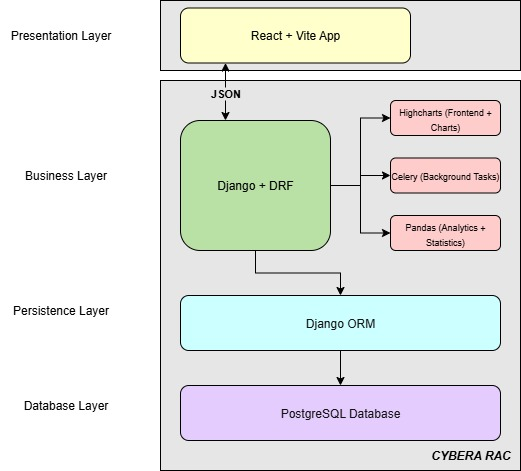
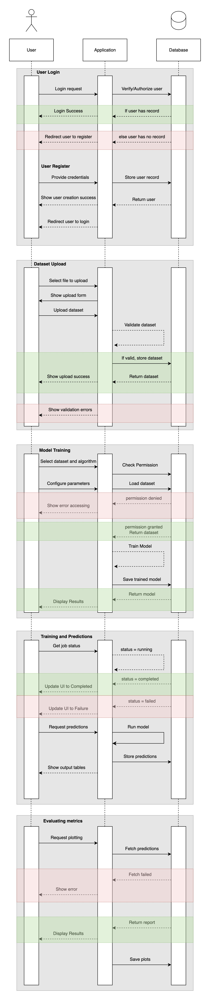
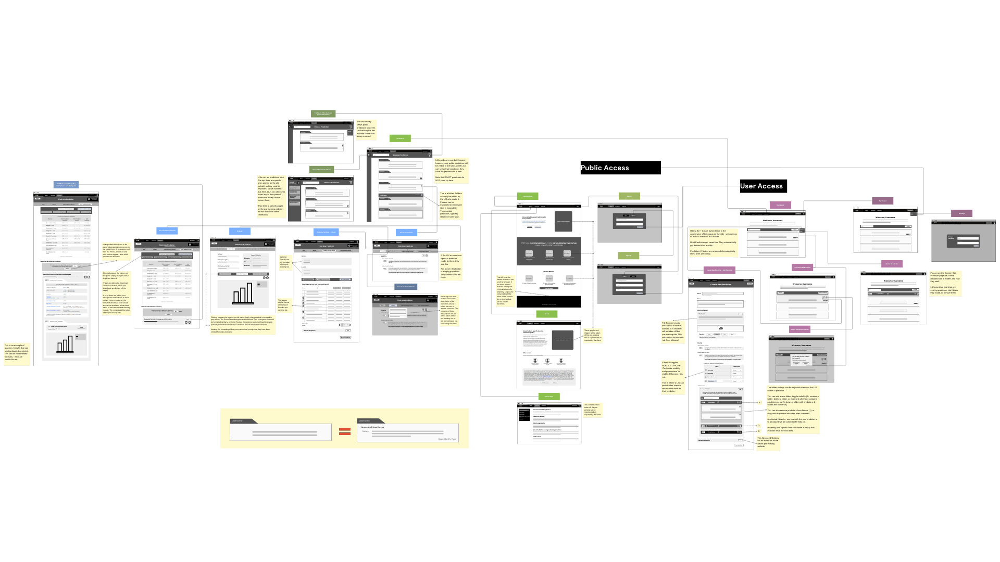

# **Software Design**   

## High-level Architecture 

This architecture follows a four-layer structure where a React + Vite frontend communicates via JSON with a Django REST Framework backend that handles analytics, background tasks, and chart generation. The backend connects through Django ORM to a PostgreSQL database for secure data storage and retrieval.

{target=_blank}  

## UML Class Diagram

This diagram represents a controller–model architecture where multiple controllers manage user actions and system processes, interacting with interconnected data models that handle datasets, users, training, predictions, and analysis workflows.

{target=_blank}  

## Sequence Diagram

This sequence diagram shows how users interact with the application and database during key processes such as logging in, uploading datasets, training models, making predictions, and evaluating results, highlighting the flow of information and system responses throughout each step.

{target=_blank}  

## Wireframes

This user flow diagram illustrates how public and registered users navigate through the application from login and registration to dataset management, model training, and prediction generation, showing how users interact with dashboards, upload data, train models, and use trained predictors for analysis and insights.

{target=_blank}

For a clearer look, go [here](https://www.canva.com/design/DAG0JPaxo_k/sMor9R0tpLJT6JhqGsAFkg/view?utm_content=DAG0JPaxo_k&utm_campaign=designshare&utm_medium=link2&utm_source=uniquelinks&utlId=h867f811d61).  

## UI Design Principles and Usability Heuristics 

1. **Visibility of System Status** 
>The interface provides clear feedback when users perform actions (e.g., loading indicators, confirmation messages). This ensures users always understand the system’s state and builds trust through predictable interactions. 
2. **Match Between the System and the Real World**
>Terminology and visual icons match real-world conventions familiar to users (e.g., “Dashboard,” “Submit,” “Profile”, "About"), minimizing confusion. 
3. **User Control and Freedom**
>Users can easily cancel or undo actions across writable/readable content (e.g., “Back” or “Cancel” buttons are visible and functional). 
4. **Consistency and Standards**
>- Consistent button styles, font sizes, and colors are used throughout the interface.
>- Navigation and layout patterns remain uniform and consistent across pages. 
5. **Error Prevention**
>- Form validation prevents submission of invalid data before users commit an action.
>- Clear instructions page guide users, minimizing input errors. 
6. **Recognition Rather than Recall**
>Navigation items and buttons remain visible and fixed, so users don’t have to remember locations or options. 
7. **Flexibility and Efficiency of Use**
>Interactive interface (Drag and Drop) improves efficiency and flexibility for frequent users. 
8. **Aesthetic and Minimalist Design**
>- The design avoids clutter and unnecessary decorative elements, keeping a clean and polished view.
>- Color palette and spacing prioritize clarity and focus. 
9. **Help Users Recognize, Diagnose, and Recover from Errors**
>Error messages are written in plain language, clearly indicating what went wrong and how to fix it. 
10. **Help and Documentation**
>Documentation is available directly within the project site (this MkDocs documentation), including step-by-step guidance on using the system. 
 
