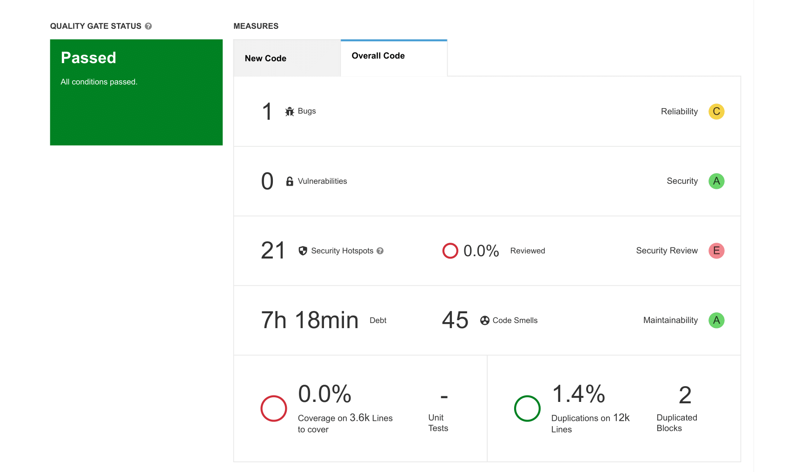

# **Project Management**

## Story Map 

{target=_blank}
View more details in [here](https://www.canva.com/design/DAG0T0_u72A/NvHJ91Rbdcr9bjI9JHdpyw/edit).
  

## Project Plan

Meeting Minutes are [here](https://docs.google.com/document/d/1bArJtUYmxfYM_rN1SvNpHSekmJAgwimwr7Q_biq6nQU/edit?usp=sharing)

### Sprint 1 

*Due date: 28 Sept 2025*

| Task | Description | Date Completed | Assignee(s) |
|-|-|-|-|
| 1 | Initial MkDocs Setup and Sections Drafted | Sept 19 | Yaatheshini |
| 2 | Project Requirements Document Update | Sept 22 | Selena, Yaatheshini | 
| 3.1 | High-level Architecture Design | Sept 24 | Advi, Excel | 
| 3.2 | UML Class Diagram | Sept 24 | Yaatheshini, Alex, Shahmeer | 
| 3.3 | Sequence Diagram | Sept 24 | Yaatheshini, Advi | 
| 3.4 | Wireframes | Sept 24 | Selena, Hoang | 
| 3.5 | Storymap | Sept 27 | Hoang | 
| 3.6 | Team Canvas | Sept 25 | Hoang, Advi, Selena, Yaatheshini, Alex, Shahmeer, Excel | 
| 4 | Tech Stack | Sept 26 | Advi, Selena, Yaatheshini | 
| 6 | User Issues Added on GitHub | Sept 26 | Yaatheshini, Selena | 
| 7 | Acceptance Tests added on wesbite | Sept 25 | Alex | 
| 8 | Story Points, tags and assignees added | Sept 27 | Advi, Selena | 
| 9 | Project Plan | Sept 27 | Selena |
| 10 | Teamwork Document | Sept 24 | Yaatheshini, Selena | 
| 11 | Belbin Roles | Sept 24 | Yaatheshini | 

* > First Draft of All Deliverables Due: **Thursday, Sept 25**  

* > Actually Finished: **Saturday, Sept 27**  

* > Confirm Submission: **Sunday, Sept 28**  
  

### Sprint 2

*Due date: 12 Oct 2025*

**List of user stories to be completed**

| User Story Number | Description | Story Points | Assignee(s) |
|-|-|-|-|
| US 1.1 | User Logging In / Out | 3 | Advi, Selena, Yaatheshini |
| US 1.1.1 | Change Password and User Information | 3 | Advi, Selena, Yaatheshini | 
| US 1.3 | Logged-In User Dashboard | 3 | Advi, Selena | 
| US 1.3.1 | Verify a Dataset is Formatted Correctly | 3 | Alex, Hoang| 
| US 1.3.3 | Predictor Privacy | 2 | Yaatheshini, Selena | 
| US 1.3.7 | Pin Predictors | 3 | Yaatheshini, Selena | 
| US 1.4.1 | Search for a Dataset / Predictor | 1 | Selena |
| US 1.4.2 | Filter Predictors By Public / Private Access | 1 | Selena | 
| US 1.5 | Admin Access (Panel Set-Up) | 3 | Yaatheshini | 
| US 1.7 | Landing Page | 2 | Shahmeer | 
| US 1.8 | About Page | 2 | Shahmeer | 
| US 4.1 | Instructions Page | 1 | Hoang | 
| US 6.1 | Frontend Tests for Sprint 2 | 5 | Yaatheshini |

**Estimated sprint velocity**: 32

* > First Draft of All Deliverables Due: **Thursday, Oct 9**

* > Actually Finished: **Sunday, Oct 13**

* > Confirm Submission: **Sunday, Oct 13**
  

### Sprint 3

*Due date: 26 Oct 2025*

**List of user stories to be completed**

| User Story Number | Description | Story Points | Assignee(s) |
|-|-|-|-|
| US 1.2 | Admin Logging In / Out | 1 | Advi, Yaatheshini |
| US 1.3.2 | Upload a Dataset | 3 | Alex, Hoang, Advi, Selena | 
| US 1.3.4 | Create a Predictor | 3 | Yaatheshini, Excel, Selena |
| US 1.3.5 | Edit a Predictor | 1 | Excel, Advi |  
| US 1.3.6 | Delete a Predictor | 1 | Advi | 
| US 1.3.3.1 | Share Private Predictors | 5 | Yaatheshini | 
| US 1.4 | Display Predictors & Datasets | 2 | Advi, Selena, Yaatheshini | 
| US 1.6 | Create Folders | 2 | Hoang | 
| US 1.6.1 | Delete Folders | 1 | Hoang | 
| US 1.6.2 | Toggle Folder Visibility | 5 | Hoang | 
| US 1.6.3 | Move Predictors Between Folders | 5 | Hoang |  
| US 2.1.3.1 | Search for Features | 2 | Alex | 
| US 2.1.3.2 |  Select and Deselect All Features | 2 | Alex | 
| US 2.1.3.3 | Paginate Features | 2 | Selena |  
| US 6.2 |  Frontend tests for Sprint 3 | 5 | Yaatheshini | 

**Estimated sprint velocity**: 40

* > Initial Check-In - **October 19th**

* > Actually Finished: **Sunday, Oct 26**

* > Confirm Submission: **Sunday, Oct 26**
  

### Sprint 4

*Due date: 9 Nov 2025*

**List of user stories to be completed**

| User Story Number | Description | Story Points | Assignee(s) |
|-|-|-|-|
| US 2.1.3 | Re-Train Predictors | 8 | Excel, Selena | 
| US 2.2 |  Implement Learning Tools | 8 | Excel, Alex | 
| US 3.4 | Dataset Metrics / Analysis | 8 | Hoang, Advi |
| US 6.3 | Frontend tests for Sprint 4 | 8 | Yaatheshini | 

**Estimated sprint velocity**: 32

* > Initial Check-In - **November 2nd**

* > Due (for Review) - (tentative) **November 6th**

* > Due - (tentative) **November 8th**
  

### Sprint 5

*Due date: 30 Nov 2025*

**List of user stories to be completed**

| User Story Number | Description | Story Points | Assignee(s) |
|-|-|-|-|
| US 1.3.8 | Save My Draft Predictors  | 3 | Advi, Yaatheshini | 
| US 2.1.2 | Save Predictions After Runs on Lablled Data  | 3 | Excel, Selena | 
| US 2.3 | Cross-Validation Evaluation of Predictor | 3 | Alex, Excel | 
| US 3.1| Run Predictors on Unlabeled Data  | 5 | Excel |
| US 3.2 | Prediction Display Formats  | 5 | Hoang | 
| US 3.3| Quality Evaluation of Predictors  | 3 | Excel | 
| US 3.5 | Print Results | 2 | Shahmeer, Selena | 
| US 3.2 | Download Results  | 2 | Shahmeer | 
| US 3.7 | Superuser-Specific Analysis Tools  | 3 | Advi | 
| US 4.1.1 | Hover Over Buttons / Tabs for Info | 2 | Selena |
| US 4.2 | Instructions + Demo Video  | 3 | Alex, Hoang, Yaatheshini |   
| US 6.4 | Frontend tests for Sprint 5 | 5 | yaatheshini | 

**Estimated sprint velocity**: 39

* > Initial Check-In - **November 23th**

* > Due (for Review) - (tentative) **November 27th**

* > Due - (tentative) **November 29th**
  

## Interface (APIs and Modules)

### 1. Overview
The backend is divided into four main modules: `accounts`, `authapp`, `dataset`, and `predictors`.  
Each module is responsible for a distinct part of the system and communicates with others through well-defined interfaces, primarily using REST API endpoints and shared database models.  
This modular structure keeps the codebase organized and makes it easier to maintain, test, and extend.
 

#### **Accounts Module** 
1. **Purpose:**  
  Handles user profile data such as name, email, and organization. It provides endpoints for retrieving and updating user information. 

2. **Interface Type:**  
  DRF serializers and viewsets that expose user-related CRUD operations. 

3. **Interactions:**  
>- Works with **AuthApp** to validate user identity through JWT tokens.  
>- Provides user information and ownership data to the **Dataset** and **Predictors** modules.  
>- Allows the frontend to access and display authenticated user profiles. 
 

#### **AuthApp Module** 
1. **Purpose:**  
  Manages all authentication and authorization processes, including user registration, login, logout, and password resets. 

2. **Interface Type:**  
  DRF APIViews that provide authentication endpoints and issue JWT tokens for secure user sessions. 

3. **Interactions:**  
>- Provides authentication tokens used by **Accounts**, **Dataset**, and **Predictors** to authorize requests.  
>- Updates and verifies user credentials stored in the shared `User` model used by **Accounts**.  
>- Acts as the main entry point for verifying user identity across all other modules. 
 

#### **Dataset Module** 
1. **Purpose:**  
  Manages user-uploaded datasets, including creation, retrieval, and permission control for sharing with other users. 

2. **Interface Type:**  
  DRF ViewSets and serializers that define dataset CRUD operations and permission endpoints. 

3. **Interactions:**  
>- Uses authentication from **AuthApp** to verify user access before allowing dataset operations.  
>- Associates each dataset with a user record from **Accounts** to manage ownership.  
>- Provides dataset resources to the **Predictors** module for use in model training and prediction.
 

#### **Predictors Module** 
1. **Purpose:**  
  Handles machine learning predictors, including model configuration, execution, and storage of results. 

2. **Interface Type:**  
  DRF ViewSets and serializers that define endpoints for creating and managing predictors. 

3. **Interactions:**  
>- Requires authentication from **AuthApp** to ensure only authorized users can create or run predictors.  
>- Uses ownership and user data from **Accounts** to associate predictors with specific users.  
>- Depends on **Dataset** for input data during prediction and training tasks. 

### 2. Data Flow Summary
1. Users authenticate through **AuthApp**, which issues JWT tokens.  
2. The **Accounts** module uses the token to retrieve or update user information.  
3. The **Dataset** module allows authenticated users to upload, manage, and share datasets.  
4. The **Predictors** module accesses datasets and performs predictions based on the authenticated user’s data.  
5. All data exchanged between modules follows standardized REST API contracts using JSON.
  

## Requirement Traceability Matrix  

### Accounts App

| User Story ID | Requirement Description | Test Case(s) | Test File | Coverage Status |
|---------------|------------------------|--------------|-----------|----------------|
| US 1.1.1 | User can change their password using the correct old password and matching confirmation. | `test_change_password_success` | `test_accounts.py` | Covered |
| US 1.1.1 | Changing password should fail if old password is incorrect. | `test_change_password_incorrect_old` | `test_accounts.py` | Covered |
| US 1.1.1 | Changing password should fail if new and confirm passwords do not match. | `test_change_password_mismatch` | `test_accounts.py` | Covered |
| US 1.1.1 | Unauthenticated users cannot change password. | `test_unauthenticated_cannot_change_password` | `test_accounts.py` | Covered |
| US 1.3 | Authenticated users can view their own profile information at `/me/`. | `test_get_profile` | `test_accounts.py` | Covered |
| US 1.3 | Authenticated users can update their profile (first and last name) through `/me/`. | `test_update_profile` | `test_accounts.py` | Covered |
| US 1.3 | Unauthenticated users cannot access the `/me/` endpoint. | `test_unauthenticated_cannot_access_me` | `test_accounts.py` | Covered |

### AuthApp

| User Story ID | Requirement Description | Test Case(s) | Test File | Coverage Status |
|---------------|------------------------|--------------|-----------|----------------|
| US 1.1 | User can log in with valid credentials and receive access/refresh tokens. | `test_login_user` | `test_auth.py` | Covered |
| US 1.1 | User can log out and invalidate refresh tokens. | `test_logout_user` | `test_auth.py` | Covered |
| US 1.1 | User can refresh access tokens using a valid refresh token. | `test_refresh_token` | `test_auth.py` | Covered |
| US 1.1 | User can register a new account with valid username, email, and password. | `test_register_user` | `test_auth.py` | Covered |
| US 1.1.1 | User can initiate a forgot password request and receive a reset email. | `test_forgot_password_sends_email` | `test_auth.py` | Covered |
| US 1.1.1 | User can reset password using a valid token and new password. | `test_reset_password_success` | `test_auth.py` | Covered |
| US 1.1.1 | Admin can send password reset email to a valid user. | `test_password_reset_email_sent` | `test_auth.py` | Covered |
| US 1.1.1 | Admin password reset request with invalid email still returns a 200 OK. | `test_password_reset_invalid_email` | `test_auth.py` | Covered |
| US 1.1.1 | Admin can confirm password reset using UID and token. | `test_password_reset_confirm` | `test_auth.py` | Covered |

### Datasets App

| User Story ID | Requirement Description | Test Case(s) | Test File | Coverage Status |
|---------------|------------------------|--------------|-----------|----------------|
| US 1.3.1 | User can upload/create a dataset. | `test_create_dataset` | `test_datasets.py` | Covered |
| US 1.3.1 | Dataset creation fails if `dataset_name` is missing. | `test_create_dataset_missing_name` | `test_datasets.py` | Covered |
| US 1.3.1 | Owner can update their dataset. | `test_update_dataset` | `test_datasets.py` | Covered |
| US 1.3.1 | Owner can delete their dataset. | `test_delete_dataset` | `test_datasets.py` | Covered |
| US 1.3.1 | Non-owner cannot update a dataset. | `test_non_owner_cannot_update` | `test_datasets.py` | Covered |
| US 1.3.1 | Non-owner cannot delete a dataset. | `test_non_owner_cannot_delete` | `test_datasets.py` | Covered |
| US 1.3.1 | Non-owner can view a dataset if granted permission. | `test_non_owner_can_view_if_granted` | `test_datasets.py` | Covered |
| US 1.3.1 | Non-owner cannot view a dataset if not granted permission. | `test_non_owner_cannot_view_if_not_granted` | `test_datasets.py` | Covered |

### Predictors App

| User Story ID | Requirement Description | Test Case(s) | Test File | Coverage Status |
|---------------|------------------------|--------------|-----------|----------------|
| US 1.3.4 | User can create a predictor. | `test_create_predictor` | `test_predictors.py` | Covered |
| US 1.3.5 | User can edit a predictor. | `test_edit_predictor` | `test_predictors.py` | Covered |
| US 1.3.6 | User can delete a predictor. | `test_delete_predictor` | `test_predictors.py` | Covered |
| US 1.3.3 | Predictor privacy – only owners and permitted users can view a predictor. | `test_non_owner_can_view_if_granted` | `test_predictors.py` | Covered |
| US 1.3.3 | Non-owner cannot view a predictor if access is restricted. | `test_non_owner_cannot_view_if_restricted` | `test_predictors.py` | Covered |
| US 1.3.5 | Non-owner cannot edit a predictor. | `test_non_owner_cannot_update` | `test_predictors.py` | Covered |
| US 1.3.6 | Non-owner cannot delete a predictor. | `test_non_owner_cannot_delete` | `test_predictors.py` | Covered |

### Selenium Testing

| User Story ID | Requirement Description | Test Case(s) | Test File | Coverage Status |
|---------------|------------------------|--------------|-----------|----------------|
| US 1.1 | User Logging In / Out & Forgot Password | `test_full_password_reset_flow` | `test_user_login_logout_reset.py` | Covered |
| US 1.2 | Admin Logging In / Out & Forgot Password | `test_admin_login_logout_reset` | `test_admin_login_logout_reset.py` | Covered |
| US 1.5 | Admin Access (Panel Set-Up) | `test_admin_login_logout_reset` | `test_admin_login_logout_reset.py` | Covered |
| US 1.3 | Logged-In User Dashboard | `test_full_password_reset_flow` | `test_user_login_logout_reset.py` | Covered |
| US 1.7 | User Landing Page | `test_full_password_reset_flow` | `test_user_login_logout_reset.py` | Covered |
| US 1.8 | User About Page | `test_full_password_reset_flow` | `test_user_login_logout_reset.py` | Covered |
| US 4.1 | User Instructions Page | `test_full_password_reset_flow` | `test_user_login_logout_reset.py` | Covered |
| US 1.3.7 | Pin Predictors | `test_full_password_reset_flow` | `test_user_login_logout_reset.py` | Covered |

## SonarQube Analysis
{target=_blank}  

### The codebase successfully **Passed** the default Quality Gate. The breakdown of the analysis is as follows:

### A. Overall Health Metrics
According to the overview dashboard, the backend maintains a high standard of code health:
* **Reliability:** Rated **A** (1 Bug found).
* **Security:** Rated **A** (6 Vulnerabilities found).
* **Maintainability:** Rated **A** (45 Code Smells found with a technical debt of ~7 hours).
* **Duplications:** The code is very DRY (Don't Repeat Yourself), with only **1.4%** code duplication across 12k lines.

### B. Key Issues Identified
While the project passed the quality gate, the detailed issue report highlighted several areas for refactoring to improve long-term maintainability:

**1. Cognitive Complexity (Maintainability)**
The most significant issue identified is **Cognitive Complexity**. SonarQube flagged several functions where the logic flow is too difficult to follow (nested loops, complex `if/else` chains).
* *Example:* A function in `isd/predictors/views.py` has a complexity score of **59**, well above the allowed threshold of 15.
* *Example:* `isd/dataset/statistics.py` has functions exceeding complexity limits (scores of 17 and 41).
* *Impact:* High complexity increases the risk of introducing bugs during future updates. These functions should be broken down into smaller helper methods.

**2. Error Handling (Reliability)**
The scanner detected the use of generic exceptions (`except Exception:`) in `isd/dataset/views.py` and `isd/predictors/views.py`.
* *Impact:* Catching generic exceptions can mask unexpected errors and make debugging difficult. The report suggests using specific exception classes.

**3. Code Cleanup (Technical Debt)**
There are multiple instances of "dead code" that clutter the repository:
* **Unused Variables:** Variables like `e`, `folder`, and `label_cols` are defined but never used.
* **Commented-out Code:** Found in `isd/predictors/models.py`, which should be removed to keep the source files clean.
* **Unused Parameters:** Function parameters like `return_cv_predictions` that are not utilized within the function body.

**4. Hardcoded Literals (Design)**
The tool flagged strings such as `"Predictor not found"` and `"Dataset has no associated file"` being duplicated multiple times.
* *Solution:* These should be defined as constants at the top of the file to prevent typos and ease translation/changes.

### 4. Conclusion
The SonarQube analysis confirms that the `isd` backend is structurally sound with low duplication and passing security grades. However, to reduce technical debt, the team plans to refactor the high-complexity views in `predictors` and `dataset`, and sanitize the code by removing unused variables and commented-out blocks.