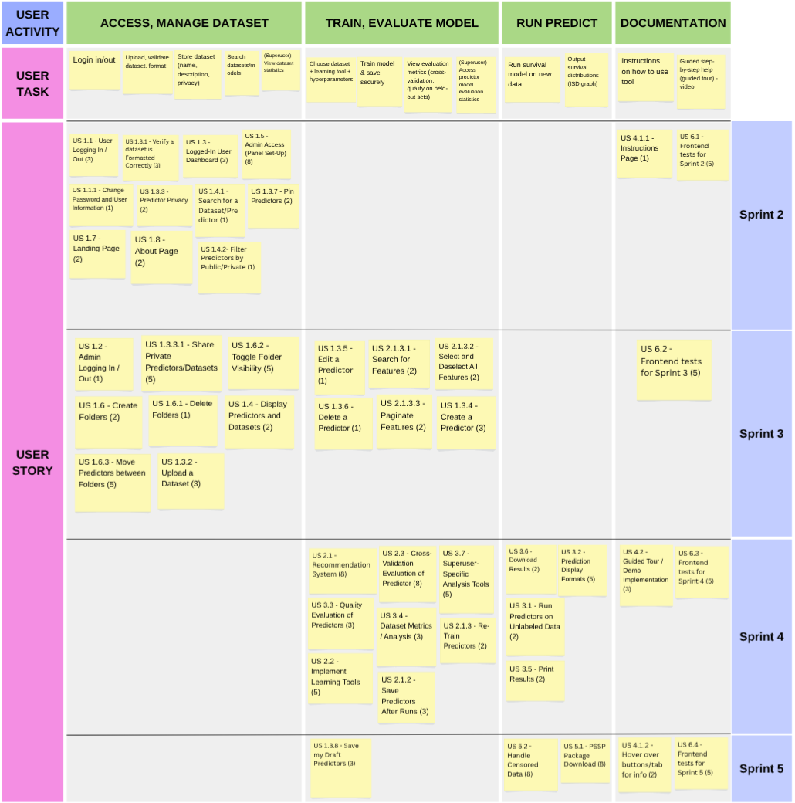

# **Project Management**

## Story Map 

{target=_blank}
View more details in [here](https://www.canva.com/design/DAG0T0_u72A/NvHJ91Rbdcr9bjI9JHdpyw/edit).

## Project Plan

Meeting Minutes are [here](https://docs.google.com/document/d/1bArJtUYmxfYM_rN1SvNpHSekmJAgwimwr7Q_biq6nQU/edit?usp=sharing)

### Sprint 1 

*Due date: 28 Sept 2025*

##### Initial MkDocs Setup and Sections Drafted (Yaatheshini: Sept 19)

##### Project Requirements Document Update (Selena: Sept 21, Yaatheshini: Sept 22)
**Completed**

##### Software Design Document
    - High-level Architecture (Excel, Advi)
        Due: Wednesday, Sept 24
        **Completed**

    - UML Class Diagram (Yaatheshini, Alex, Shahmeer)
        Due: Wednesday, Sept 24
        **Completed**

    - Sequence Diagrams
        Dependent on UML Class Diagram - will revisit Wednesday 
        - revisited: (Yaatheshini, Advi)
          **Completed**

    - Wireframes (Selena, Hoang)
        Due: Wednesday, Sept 24
        **Completed**

    - Tech Stack
        Discuss further with TA on Wednesday
        - discussed; also discussed further within team
          **Completed**; consensus reached for now

##### Project Management Document (Selena: Sept 21, Yaatheshini: Sept 22)
    - User Issues Added on GitHub (Yaatheshini: Sept 22)
      - Acceptance Tests added on wesbite (Alex)
      - User Issues and Stories fleshed out on both website / GitHub (Selena)
        - Story Points and tags added (Selena, Advi)
        - Assignees added
          **Completed**

    - Storymap (Hoang)
        Discuss storymap structure and trajectory on Wednesday
        - Planned it out (Hoang)
          **Completed**

    - Project Plan (Selena: Sept 21)
      **Completed**

##### Teamwork Document (Yaatheshini, Selena) Pending
    - Team Canvas (Everyone)
      **Completed**

    - Belbin Roles
		Everyone has been asked to send in their Belbin roles + preferences on the #teamwork-doc channel on Discord.
		Discuss other specifics on Wednesday, Sept 24. Pending discussion with TA.
        - discussed, asked about how preference works
          **Completed** 

##### First Draft of All Deliverables Due: Thursday, Sept 25
##### Actually Finished: Saturday, Sept 27
##### Confirm Submission: Sunday, Sept 28

### Sprint 2

*Due date: 12 Oct 2025*

#### List of user stories to be completed

| User Story Number | Description | Story Points | Assignee(s) |
|-|-|-|-|
| US 1.1 | User Logging In / Out | 3 | Yaatheshini, Advi |
| US 1.1.1 | Change Password | 1 | Alex | 
| US 1.2 | Superuser / Admin Logging In / Out | 1 | Hoang, Excel |
| US 1.3 | Logged-In User Dashboard | 3 | Advi, Selena | 
| US 1.3.1 | Upload a Dataset | 3 | Yaatheshini, Excel | 
| US 1.3.3 | Predictor Privacy | 2 | Advi, Shahmeer | 
| US 1.3.4 | Create a Predictor | 3 | Selena, Excel, Alex | 
| US 1.3.5 | Edit a Predictor | 3 | Shahmeer, Yaatheshini |  
| US 1.3.6 | Delete a Predictor | 1 | Advi, Yaatheshini | 
| US 1.3.7 | Pin Predictors | 3 | Advi, Selena | 
| US 1.4.1 | Display Predictors | 2 | Advi, Selena | 
| US 1.5 | Superuser / Admin Access (Panel Set-Up) | 8 | Advi, Selena, Alex, Yaatheshini, Hoang | 
| US 1.7 | Landing Page | 2 | Excel | 
| US 1.8 | About Page | 2 | Shahmeer | 
| US 4.1.1 | Instructions Page | 1 | Alex, Yaatheshini | 
| US 4.1.2 | Hover Over Button / Tab for Info | 2 | Selena | 
| US 6.1 | Tests for Sprint 2 | 3 | Shahmeer, Alex | 

**Estimated sprint velocity**: 43

* > Initial Check-In - **October 5th**

* > Due (for Review) - (tentative) **October 9th**

* > Due - (tentative) **October 11th**

## Requirement Traceability Matrices 
 
### Accounts App

| User Story ID | Requirement Description | Test Case(s) | Test File | Coverage Status |
|---------------|------------------------|--------------|-----------|----------------|
| US 1.1.1 | User can change their password using the correct old password and matching confirmation. | `test_change_password_success` | `test_accounts.py` | Covered |
| US 1.1.1 | Changing password should fail if old password is incorrect. | `test_change_password_incorrect_old` | `test_accounts.py` | Covered |
| US 1.1.1 | Changing password should fail if new and confirm passwords do not match. | `test_change_password_mismatch` | `test_accounts.py` | Covered |
| US 1.1.1 | Unauthenticated users cannot change password. | `test_unauthenticated_cannot_change_password` | `test_accounts.py` | Covered |
| US 1.3 | Authenticated users can view their own profile information at `/me/`. | `test_get_profile` | `test_accounts.py` | Covered |
| US 1.3 | Authenticated users can update their profile (first and last name) through `/me/`. | `test_update_profile` | `test_accounts.py` | Covered |
| US 1.3 | Unauthenticated users cannot access the `/me/` endpoint. | `test_unauthenticated_cannot_access_me` | `test_accounts.py` | Covered |

### AuthApp

| User Story ID | Requirement Description | Test Case(s) | Test File | Coverage Status |
|---------------|------------------------|--------------|-----------|----------------|
| US 1.1 | User can log in with valid credentials and receive access/refresh tokens. | `test_login_user` | `test_auth.py` | Covered |
| US 1.1 | User can log out and invalidate refresh tokens. | `test_logout_user` | `test_auth.py` | Covered |
| US 1.1 | User can refresh access tokens using a valid refresh token. | `test_refresh_token` | `test_auth.py` | Covered |
| US 1.1 | User can register a new account with valid username, email, and password. | `test_register_user` | `test_auth.py` | Covered |
| US 1.1.1 | User can initiate a forgot password request and receive a reset email. | `test_forgot_password_sends_email` | `test_auth.py` | Covered |
| US 1.1.1 | User can reset password using a valid token and new password. | `test_reset_password_success` | `test_auth.py` | Covered |
| US 1.1.1 | Admin can send password reset email to a valid user. | `test_password_reset_email_sent` | `test_auth.py` | Covered |
| US 1.1.1 | Admin password reset request with invalid email still returns a 200 OK. | `test_password_reset_invalid_email` | `test_auth.py` | Covered |
| US 1.1.1 | Admin can confirm password reset using UID and token. | `test_password_reset_confirm` | `test_auth.py` | Covered |

### Datasets App

| User Story ID | Requirement Description | Test Case(s) | Test File | Coverage Status |
|---------------|------------------------|--------------|-----------|----------------|
| US 1.3.1 | User can upload/create a dataset. | `test_create_dataset` | `test_datasets.py` | Covered |
| US 1.3.1 | Dataset creation fails if `dataset_name` is missing. | `test_create_dataset_missing_name` | `test_datasets.py` | Covered |
| US 1.3.1 | Owner can update their dataset. | `test_update_dataset` | `test_datasets.py` | Covered |
| US 1.3.1 | Owner can delete their dataset. | `test_delete_dataset` | `test_datasets.py` | Covered |
| US 1.3.1 | Non-owner cannot update a dataset. | `test_non_owner_cannot_update` | `test_datasets.py` | Covered |
| US 1.3.1 | Non-owner cannot delete a dataset. | `test_non_owner_cannot_delete` | `test_datasets.py` | Covered |
| US 1.3.1 | Non-owner can view a dataset if granted permission. | `test_non_owner_can_view_if_granted` | `test_datasets.py` | Covered |
| US 1.3.1 | Non-owner cannot view a dataset if not granted permission. | `test_non_owner_cannot_view_if_not_granted` | `test_datasets.py` | Covered |

### Predictors App

| User Story ID | Requirement Description | Test Case(s) | Test File | Coverage Status |
|---------------|------------------------|--------------|-----------|----------------|
| US 1.3.4 | User can create a predictor. | `test_create_predictor` | `test_predictors.py` | Covered |
| US 1.3.5 | User can edit a predictor. | `test_edit_predictor` | `test_predictors.py` | Covered |
| US 1.3.6 | User can delete a predictor. | `test_delete_predictor` | `test_predictors.py` | Covered |
| US 1.3.3 | Predictor privacy – only owners and permitted users can view a predictor. | `test_non_owner_can_view_if_granted` | `test_predictors.py` | Covered |
| US 1.3.3 | Non-owner cannot view a predictor if access is restricted. | `test_non_owner_cannot_view_if_restricted` | `test_predictors.py` | Covered |
| US 1.3.5 | Non-owner cannot edit a predictor. | `test_non_owner_cannot_update` | `test_predictors.py` | Covered |
| US 1.3.6 | Non-owner cannot delete a predictor. | `test_non_owner_cannot_delete` | `test_predictors.py` | Covered |

### Sprint 3

*Due date: 26 Oct 2025*

#### List of user stories to be completed

| User Story Number | Description | Story Points | Assignee(s) |
|-|-|-|-|
| US 1.3.2 | Upload Formatted Datasets | 3 | **TBD** |
| US 1.3.3.1 | Share Private Predictors | 5 | **TBD** | 
| US 1.4.2 | Search for a Dataset / Predictor | 3 | **TBD** |
| US 1.4.3 | Filter Predictors By Public / Private Access | 1 | **TBD** | 
| US 1.6.1 | Create Folders | 2 | **TBD** | 
| US 1.6.2 | Delete Folders | 1 | **TBD** | 
| US 1.6.3 | Toggle Folder Visibility | 5 | **TBD** | 
| US 1.6.4 | Move Predictors Between Folders | 5 | **TBD** |  
| US 2.1 | Identify an accessible dataset, a specific learning tool, and a specification of that learner's hyperparameter | 8 | **TBD** | 
| US 2.1.2 | Save Predictors After Runs | 3 | **TBD** | 
| US 2.1.3 | Re-Train Predictors | 2 | **TBD** | 
| US 2.1.3.1 | Search for Features | 2 | **TBD** | 
| US 2.1.3.2 |  Select and Deselect All Features | 2 | **TBD** | 
| US 2.1.3.3 | Paginate Features | 2 | **TBD** |  
| US 2.2 |  Implement Learning Tools | 5 | **TBD** | 
| US 2.3 | Cross-Validation Evaluation of Predictor | 8 | **TBD** | 
| US 4.2 | Guided Tour / Demo Implementation | 3 | **TBD** | 

**Estimated sprint velocity**: 60

* > Initial Check-In - **October 19th**

* > Due (for Review) - (tentative) **October 23th**

* > Due - (tentative) **October 25th**

### Sprint 4

*Due date: 9 Nov 2025*

#### List of user stories to be completed

| User Story Number | Description | Story Points | Assignee(s) |
|-|-|-|-|
| US 3.1 | Run Predictors on Unlabeled Data | 2 | **TBD** |
| US 3.3 | Quality Evaluation of Predictors | 3 | **TBD** | 
| US 3.4 | Dataset Metrics / Analysis | 3 | **TBD** |
| US 3.5 | Print Results | 2 | **TBD** | 
| US 3.6 | Download Results | 2 | **TBD** | 
| US 3.7 | Superuser-Specific Analysis Tools | 5 | **TBD** | 

**Estimated sprint velocity**: 17

* > Initial Check-In - **November 2nd**

* > Due (for Review) - (tentative) **November 6th**

* > Due - (tentative) **November 8th**

### Sprint 5

*Due date: 30 Nov 2025*

#### List of user stories to be completed

| User Story Number | Description | Story Points | Assignee(s) |
|-|-|-|-|
| US 1.3.3.2 | (Optional) - Manage User Permissions on Private Predictor | 5 | **TBD** |
| US 1.3.8 | (Optional) - Save My Draft Predictors  | 3 | **TBD** | 
| US 5.1 | (Optional) - PSSP Package Download | 8 | **TBD** |
| US 5.2 | (Optional) - Handle Censored Data | 8 | **TBD** | 

**Estimated sprint velocity**: 24

* > Initial Check-In - **November 23th**

* > Due (for Review) - (tentative) **November 27th**

* > Due - (tentative) **November 29th**

