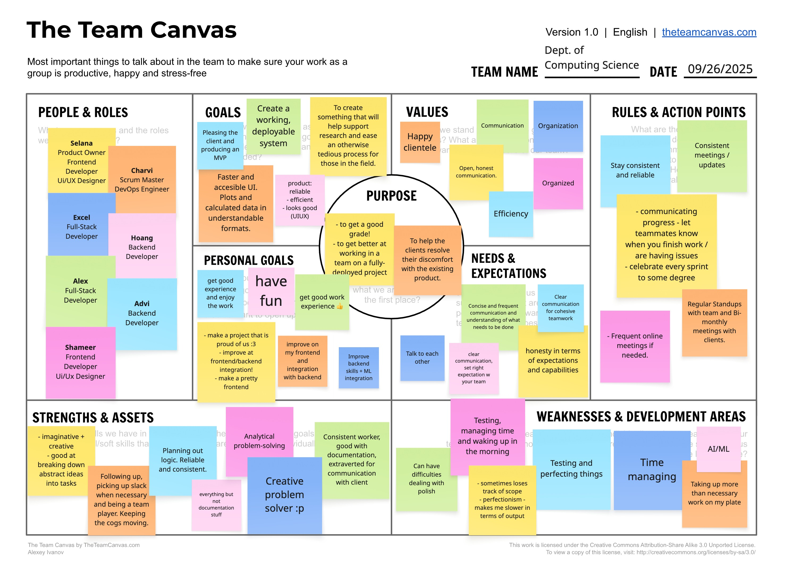

# Teamwork

This section includes three parts:

## 1. Team Canvas

## 2. Scrum Roles

- Scrum Master: Yaatheshini Ashok
- Product Owner: Selena Chainani

## 3. Belbin Team Roles

| Team Member | Belbin Roles | Preferred Roles | Manageable Roles | Least Preferred Roles | 
|-|-|-|-|-|
| Advi Islam | SH, TW, CF, IMP, RI, CO, ME, PL, SP | SH, TW, IMP | CF, RI , CO | ME, PL, SP |
| Alex Ho | SP, SH, CF, PL, IMP, CO, TW, ME, RI | RI, SP, IMP, CF, TW | ME, SH, CO | SH | 
| Excel Ojeifo | PL, CF, IMP, SP, ME, RI, CO, TW, SH | PL, CF, IMP | SP, ME, RI | CO, TW, SH |
| Hoang Nguyen | PL, CO, ME, IMP, RI, SP, SH, TW, CF | PL, IMP, SP, SH, CF | TW, ME | RI, CO |
| Selena Chainani | CF, CO, PL, RI, SH, IMP, ME, TW, SP | PL, CO, CF, IMP | TW, ME, SH, SP | RI |
| Shahmeer Rahman | | | |
| Yaatheshini Ashok Kumar | CF, CO, SH, IMP, ME, PL, TW, SP, RI | CF, CO, SH, TW | IMP, ME, PL | SP, RI | 

### Thinking Roles

#### PL (Plant)

> *Tends to be highly creative and good at solving problems in unconventional ways.* 

#### ME (Monitor Evaluator)

> *Provides a logical eye, making impartial judgements where required and weighs up the team's options in a dispassionate way.* 

#### SP (Specialist)

> *Brings in-depth knowledge of a key area to the team.* 

### Action Roles

#### SH (Shaper)

> *Provides the necessary drive to ensure that the team keeps moving and does not lose focus or momentum.* 

#### IMP (Implementer)

> *Needed to plan a workable strategy and carry it out as efficiently as possible.* 

#### CF (Completer Finisher)

> *Most effectively used at the end of tasks to polish and scrutinise the work for errors, subjecting it to the highest standards of quality control.* 

### People Roles

#### RI (Resource Investigator)

> *Uses their inquisitive nature to find ideas to bring back to the team.* 

#### TW (Teamworker)

> *Helps the team to gel, using their versatility to identify the work required and complete it on behalf of the team.* 

#### CO (Co-ordinator)

> *Needed to focus on the team's objectives, draw out team members and delegate work appropriately.* 